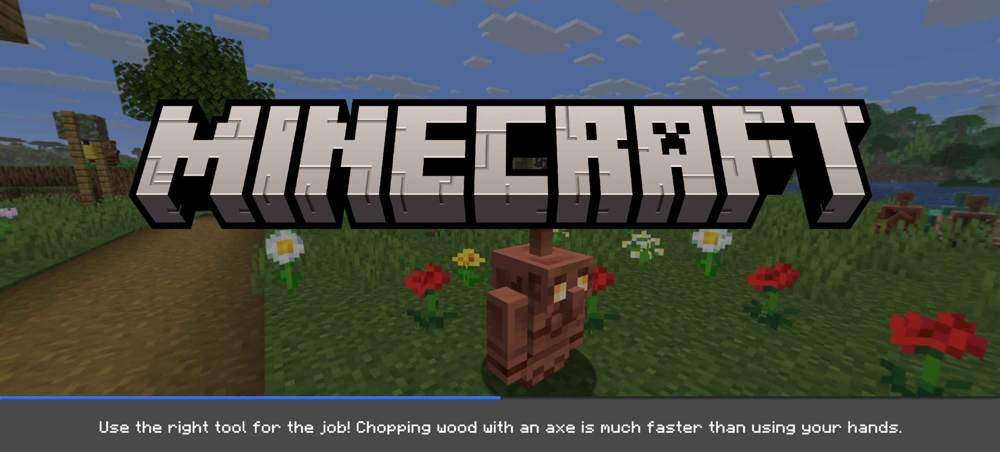

# FeatureUnlocker
##### Enable or disable hidden features. Compatible with Minecraft: Bedrock Edition 1.21.110-1.21.113.

[](https://github.com/LiteLDev/LeviLaunchroid)

# List of features
- [FeatureOptionID](include/mc/FeatureOptionID.h)

# For example `OreUINewProgressScreen` `6`
```json
{
    "disabled": [],
    "enabled": [ 6 ]
}
```


# Thanks
- [LiteLDev team](https://github.com/LiteLDev) - for their great job for mcbe modding
- [QYCottage team](https://github.com/QYCottage) - for good examples of android mods